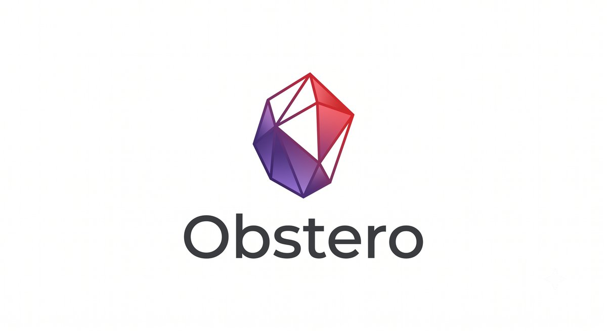

<p align="center">
  
</p>

# Obstero

Obstero is a three-stage automation pipeline that turns a messy Zotero library
into a structured, cross-linked Obsidian knowledge base — with Claude doing
the classification, summarization, and concept-linking in between.

```
Zotero  ──►  01_classification.py  ──►  02_summary.py  ──►  03_sync_to_obsidian.py  ──►  Obsidian vault
       (sort into folders + tags)   (extract PDF, summarize)   (Markdown + wiki-links)
```

## What it does

1. **Classify** (`01_classification.py`) — pulls unclassified Zotero items,
   asks Claude to pick a target folder and 3-5 tags, moves/tags the item.
2. **Summarize** (`02_summary.py`) — extracts each PDF's text, asks Claude to
   generate a structured research-intelligence note (core delta, technical
   anatomy, limitations, research/startup angles), attaches it as a Zotero
   child note.
3. **Sync** (`03_sync_to_obsidian.py`) — converts summarized items into
   Markdown files in your Obsidian vault, mirroring your Zotero collection
   structure, and auto-injects `[[wiki-links]]` for known concepts.

Every stage is **dry-run by default** — nothing is written to Zotero or your
vault until you pass `--live`. Idempotency is tracked with internal Zotero
tags (`_CLASSIFIED`, `_SUMMARIZED`) so re-running a stage never reprocesses
the same item twice.

## Requirements

- Python 3.10+
- A [Zotero](https://www.zotero.org/) account with an API key
- An [Anthropic API key](https://console.anthropic.com/)
- An Obsidian vault (or any folder you want Markdown notes written into)

## Setup

```bash
git clone <this-repo>
cd obstero
pip install -r requirements.txt
cp .env.example .env   # then fill in your credentials/paths
```

`.env` variables:

| Variable | Purpose |
|----------|---------|
| `ZOTERO_LIBRARY_ID` | Numeric Zotero user ID |
| `ZOTERO_API_KEY` | Zotero API key (read/write) |
| `CLAUDE_API_KEY` | Anthropic API key |
| `ZOTERO_BASE_DIR` | Root path to the ZotFile/OneDrive PDF folder (for linked-file attachments) |
| `OBSIDIAN_VAULT_PATH` | Absolute path to the Obsidian vault root |

Obstero also needs two personal config files (gitignored — only the
`*.example.json` versions are committed):

```bash
cp config/collections.example.json config/collections.json
cp config/primitives.example.json config/primitives.json
```

- **`config/collections.json`** maps your folder paths to Zotero collection
  keys. Generate it automatically instead of hand-editing:
  `python tools/id_extractor.py --write`
- **`config/primitives.json`** is the list of concepts to auto-link as
  `[[wiki-links]]` during sync (supports `Search Term|Target Note` aliases).
  Seed it from your existing vault: `python tools/discover_primitives.py --write`
  (or just start from the example and grow it over time — sync works fine
  with the generic fallback if this file doesn't exist yet).

## Usage

Run each stage directly, or the whole thing with the orchestrator:

```bash
# One stage at a time
python 01_classification.py                 # dry-run: preview classification of '00 - Unclassified'
python 01_classification.py --live          # actually move/tag items in Zotero
python 02_summary.py --max-papers 5         # dry-run: preview 5 summaries
python 02_summary.py --live                  # save notes + tags to Zotero
python 03_sync_to_obsidian.py --live         # write Markdown notes into the vault

# Everything, in order
python run_pipeline.py                       # dry-run, all 3 stages
python run_pipeline.py --live                # live, all 3 stages
python run_pipeline.py --live --skip-sync    # classify + summarize live, skip vault sync
```

Run `--help` on any script for the full flag list (rate limits, item caps,
chunk sizes, etc).

## Using it with Claude Code

If you're driving this repo from [Claude Code](https://claude.com/claude-code),
`.claude/skills/` wraps each stage as an invokable skill:

| Skill | What it does |
|-------|---------------|
| `/obstero-setup` | Checks `.env` and `config/*.json` exist, guides first-time setup |
| `/obstero-classify` | Runs Stage 1 |
| `/obstero-summarize` | Runs Stage 2 |
| `/obstero-sync` | Runs Stage 3 |
| `/obstero-pipeline` | Runs all 3 stages via `run_pipeline.py` |

Each skill defaults to dry-run and only adds `--live` after you explicitly
confirm — the same safety model as running the scripts by hand.

## Project layout

| Path | Contents |
|------|----------|
| `01_classification.py` / `02_summary.py` / `03_sync_to_obsidian.py` | The three pipeline stages |
| `run_pipeline.py` | Orchestrator — runs all three stages in sequence |
| `src/config.py` | `.env` + `config/*.json` loader |
| `src/zotero_api.py` | All Zotero I/O |
| `src/llm_api.py` | Claude calls: `classify_paper()` and `summarize_paper()` |
| `config/*.example.json` | Templates for your personal collection map and link taxonomy |
| `tools/id_extractor.py` | Fetches your Zotero collection key mapping |
| `tools/discover_primitives.py` | Scans your vault for the most-used wiki-links |
| `tools/normalize_links.py` | Normalizes wiki-link casing across the vault |
| `.claude/skills/` | Claude Code skills wrapping each stage |

## License

MIT — see [LICENSE](LICENSE).
